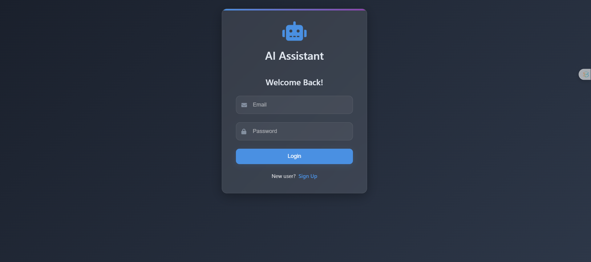
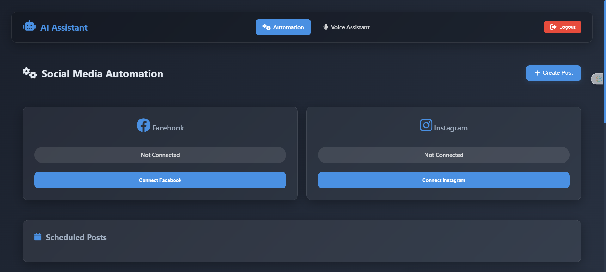
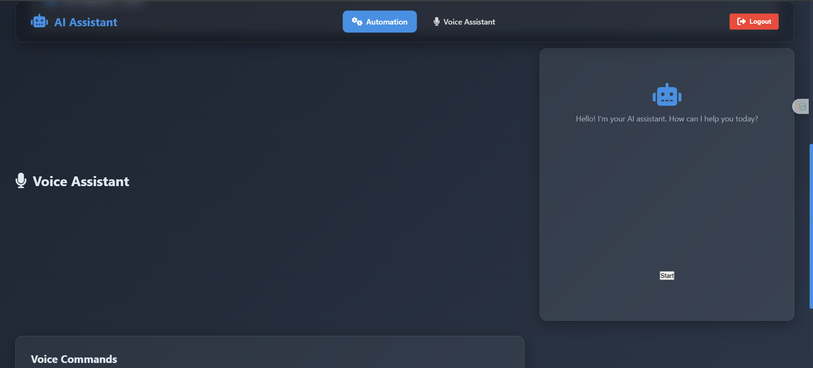

# OmniBoost ( See the developed part Below | Deployment UnderProcess )

## Preview Of OmniBoost
--- 

<div align="center">
  <table>
    <tr>
      <td align="center"></td>
      <td align="center"></td>
      <td align="center"></td>
    </tr>
  </table>
</div>

## Submission Link: [Click Here](https://lablab.ai/event/generative-ai-hackathon-with-ibm-granite/team-x/%F0%9D%97%A2%F0%9D%97%BA%F0%9D%97%BB%F0%9D%97%B6%F0%9D%97%95%F0%9D%97%BC%F0%9D%97%BC%F0%9D%98%80%F0%9D%98%81-your-next-100m-dollar-agent)

## Problem Statement
Modern marketing faces challenges such as low engagement, inefficient content creation, and time-consuming manual tasks. Marketers often struggle to maximize reach and impact while managing pitch training, SEO-friendly content, and effective social media management. There's a pressing need for an integrated solution that automates these processes, enabling businesses to focus on strategic growth without the burden of repetitive manual work.

## Solution Overview
Our AI-powered automation solution transforms marketing strategies by enhancing engagement, maximizing reach, and reducing manual tasks to save time and resources.

### Product Flow
- Pitch Training – Leverages AI-driven practice to refine presentations.
- Content Automation – Seamlessly generates SEO-friendly posts.
- Social Media Scheduler – Automates posting schedules for optimal audience engagement.
- Meme Generator – Creates viral content using advanced AI algorithms.
### Tech Stack
- APIs & Cloud Services
- Google API
- IBM’s Mixtral LLM
- Twilio
- Azure
### Frameworks & Libraries
- Langchain
- FastAPI
- WebSockets
### Database
- NeonDB
### Frontend
- HTML
- CSS
- JavaScript


## Getting Started

### Installation

1. **Clone the repository:**
   ```bash
   https://github.com/HassanMehmood413/OmniBoost.git
   cd backend
   ```

2. **Set up the backend:**
   ```bash
   poetry install
   ```

3. **Run the application:**
   - **Backend:** Start the FastAPI server:
     ```bash
     poetry run uvicorn app.main:app --reload
     ```
     


